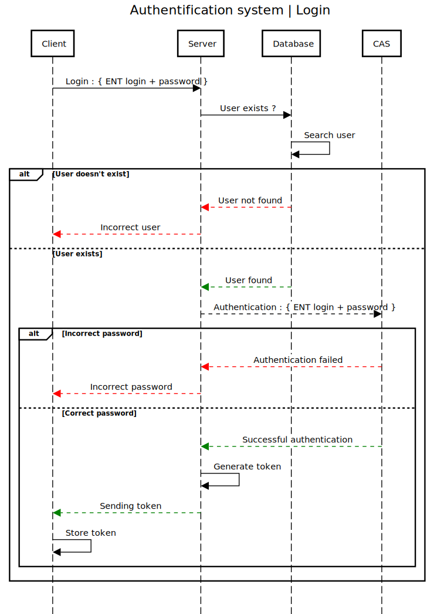

# Introduction

This example documentation contains all the possible configuration options for apidoc.

To generate this documentation:

```bash
git clone https://github.com/apidoc/apidoc && cd apidoc
npm install --prod
./bin/apidoc -i example -o /tmp/doc
$BROWSER /tmp/doc
```

# Schema

All API access is through HTTP(S) requests at `domain.tld/api/v1`. All request and response bodies are `application/json`.

# Authentication

## Login

To connect to the application, the user must exist in the database, and provide his university password to connect via the CAS.

If all user data is correct, the API provides a token, which will be needed for future authenticated requests.

-> See [Login endpoint](#post-login).



_Diagram made with [sequencediagram.org](https://sequencediagram.org/) ([source](./assets/AuthLoginDiagramSource.txt))._

## Authenticated requests

To send authenticated requests, you need to set the Authorization header as follows :

```json
Authorization: Bearer <token>
```

Our client application automatically sets this header for all requests when the user is logged in.
